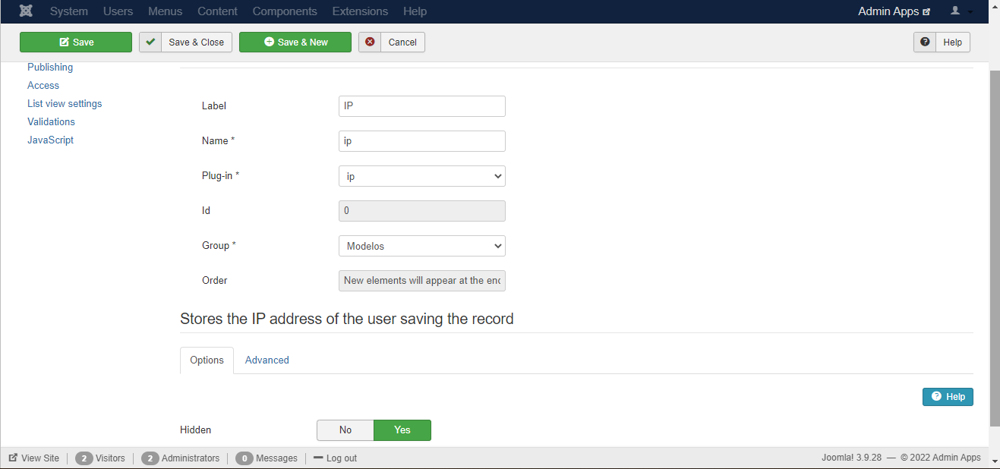

# List Cloner

## Instalação

Primeiramente, deve-se instalar o plugin list_cloner. Para isso, em sua tela de administrador do Joomla vá em Extensions->Manage->Install e clique na aba Upload Package File como na imagem abaixo.

 

Após isso, basta navegar aos arquivos .rar da extensão necessária e arrastar para a caixa de seleção, se ocorrer tudo como esperado na instalação o resultado deve ser o seguinte.

## Configurações Iniciais

Após a instalação é preciso realizar algumas etapas de configurações e verificações básicas para o correto funcionamento da API.

**1. Verificar se a extensão instalada está habilitada**

Para isso vá em Extensions->Manage->Manage e na aba de pesquisa digite "cloner" e clique enter, como na imagem abaixo. Ao aparecer o componente instalado anteriormente verifique na coluna "Status" se está habilitado, se não estiver clique em cima do ícone para habilitá-lo.

**2. Criar lista para modelos padrões**

**2.1. Criação da lista**

O plugin realiza a clonagem de modelos padrões de listas e formulários com seus respectivos relacionamentos, devido a isso, é necessário que criemos uma lista para que fique armazenado todos esses modelos que desejamos e para que consigamos adicionar mais modelos pelo front-end do joomla. Para esse propósito vá em Components->Fabrik->Lists e clique em New no canto superior esquerdo da tela, como mostra a figura.

Com a tela que abrirá, preencha o campo Label(Exemplo: Modelos) e clique em Save & Close duas vezes, como na imagem.

**2.2. Criação dos elementos**

Criado a lista, seu respectivo formulário e tabela no banco, é necessário adicionar colunas à tabela adicionando elementos à lista, dessa forma, clique em Add na coluna Element da lista recém criada. (Apenas configurações realizadas fora do padrão serão mostradas nas imagens que seguem abaixo, além disso, após cada criação de elemento clique em Save & New)

**2.2.1. Elemento Usuário**

O primeiro elemento a ser criado para a configuração da lista e do formulário modelo é referente ao usuário que estará realizando a clonagem, configurações simples são o necessário neste caso.

**2.2.2. Elemento Nome**

Este elemento servirá apenas para deixar registrado o nome dado ao modelo padrão criado.

**2.2.3. Elemento Descrição**

O elemento de descrição servirá apenas para registrar uma mensagem em relação ao modelo que estará sendo criado. (As alterações na aba Layout são opcionais)

**2.2.4. Elemento IP (Opcional)**

O registro do ip em que o usuário estará criando o modelo é feito por meio deste elemento.

**2.2.5. Elemento Última Atualização (Opcional)**

Para registrar o momento de alguma modificação no modelo criado, cria-se este elemento como segue abaixo.

 

 

 

 

**2.2.6. Elemento Fulltext**

Elemento usado internamente na criação dos modelos

 

**2.2.7. Elemento Lista Principal**

Sendo o mais importante dos elementos, ele guardará qual lista do modelo será a lista principal na clonagem, a partir da lista selecionada neste elemento que a clonagem dos relacionamentos será feita. Do tipo databasejoin, este elemento irá trazer todas as listas presentes na tabela indicada, dessa forma, como mostra a segunda imagem selecione em Table a tabela das listas do fabrik com o prefixo correto em sua instalação. (Name=main_list é obrigatório para o correto funcionamento do código)

 

**2.2.8. Elemento Listas Extras**

Sendo segundo mais importante dos elementos, ele guardará quais listas do modelo serão as listas auxiliares da principal na clonagem. Do tipo databasejoin, este elemento irá trazer todas as listas presentes na tabela indicada, dessa forma, como mostra a segunda imagem selecione em Table a tabela das listas do fabrik com o prefixo correto em sua instalação (Name=extra_lists é obrigatório para o correto funcionamento do código). Após isso, sendo o último elemento a ser criado para os modelos, clique em Save & Close.

 

Na tela que abrirá vá em Components->Fabrik->Elements no menu superior e utilize os filtros no canto inferior esquerdo para filtrar pelo form Modelos, como na imagem.

Por fim, veja que na coluna Show in List alguns plugins estão desabilitados, habilite todos eles para que apareção na lista e no formulário.

**3. Criar lista para clonagem**

**3.1. Criação da lista**

O plugin realiza a clonagem de modelos padrões de listas e formulários com seus respectivos relacionamentos, devido a isso, é necessário que criemos uma lista vinculada a um formulário para que por meio deste, vinculado ao plugin, o usuário consigo configurar os dados da clonagem e realizá-la. Para esse propósito vá em Components->Fabrik->Lists e clique em New no canto superior esquerdo da tela, como mostra a figura.

Com a tela que abrirá, preencha o campo Label(Exemplo: Clones) e clique em Save & Close duas vezes, como na imagem.

**3.2. Criação dos elementos**

Criado a lista, seu respectivo formulário e tabela no banco, é necessário adicionar colunas à tabela adicionando elementos à lista, dessa forma, clique em Add na coluna Element da lista recém criada. (Apenas configurações realizadas fora do padrão serão mostradas nas imagens que seguem abaixo, além disso, após cada criação de elemento clique em Save & New)

**3.2.1. Elemento Usuário**

O primeiro elemento a ser criado para a configuração da lista e do formulário modelo é referente ao usuário que estará realizando a clonagem, configurações simples são o necessário neste caso, após deixar como a imagem abaixo, clique em Save & New.

**3.2.2. Elemento Nome**

Este elemento servirá apenas para deixar registrado o nome dado ao modelo padrão criado.

**3.2.3. Elemento Descrição**

O elemento de descrição servirá apenas para registrar uma mensagem em relação ao modelo que estará sendo criado. (As alterações na aba Layout são opcionais)

**3.2.4. Elemento IP (Opcional)**

O registro do ip em que o usuário estará criando o modelo é feito por meio deste elemento.

**3.2.5. Elemento Última Atualização (Opcional)**

Para registrar o momento de alguma modificação no modelo criado, cria-se este elemento como segue abaixo.

 

 

 

 

**3.2.6. Elemento Fulltext**

Elemento usado internamente na criação dos modelos

 

**3.2.7. Elemento Modelo**

Elemento responsável por realizar o vínculo com a tabela de modelos criada anteriormente, ou seja, neste campo que ficará registrado no banco o id do modelo padrão em que o clone estará baseado(Name=model é obrigatório para o correto funcionamento do código). Dessa forma, no campo Table na aba Data selecione a tabela com o nome que foi criado nos passos anteriores.

 

**3.2.8. Elemento Link**

Este elemento deixará registrado o link com a lista clonada principal.

 

 

**4. Vincular o plugin ao formulário**

Feito toda a criação de elementos para as duas listas e formulários, precisamos agora vincular o nosso plugin ao formulário em que será realizado a clonagem, ou seja, o formulário criado no passo 3. Para isso, vá em Components->Fabrik->Forms no menu superior do Joomla, e clique no formulário que criamos no passo 3, como abaixo.

Depois disso, vá na aba Plug-ins e clique no botão Add. Na seção que aparecer selecione o plugin list_cloner na opção --do-- e dê uma descrição básica em description.

**5. Configurar o plugin**

Com o plugin vinculado ao formulário de clonagem role a tela para baixo e aparecerá a seção de configuração do plugin list_cloner. A primeira configuração list link será o elemento Link que criamos na etapa 3.2.8, após isso, em List title element selecione o elemento Name criado na etapa 3.2.2, em seguida, em model seleciona o elemento Modelo criado no passo 3.2.7. Para finalizar, com as configurações da lista em que irão se encontrar os modelos criados, selecione a tabela criada no passo 2.1 em Model list, em seguida em Main list element name, passe o nome do elemento criado na etapa 2.2.7, e por fim, em Auxiliary lists element name, digite o nome do elemento criado na parte 2.2.8 deste tutorial.

Com a execução de todos os passos anteriores como passado neste manual a configuração do plugin deve ter ficado da maneira como segue abaixo. Com isso, clique em Save & Close e as configurações de plugin, formulários e listas estará finalizada.

**6. Vincular itens ao menu**

Com as configurações anteriores finalizadas o próximo passo é vincular os itens criados nos passos 2 e 3 ao menu principal no front-end para que seja acessado por usuários comuns, se assim for necessário. Para tal fim, vá em Menus->Main Menu no menu superior do administrador do Joomla, como segue abaixo, e depois clique em New no canto superior esquerdo da tela.

**6.1. Vincular lista de modelos**

Como devemos primeiro criar modelos de clonagem para depois realizarmos a clonagem, vamos inicialmente vincular a lista de modelos, criada no etapa 2.1, ao menu principal. Ao ser clicado em New, se abriará as opções de configuração de um novo item de menu, dessa forma, dê um nome ao título do menu em Menu Title e em Menu Item Type precione o botão select, em seguida, ao ser aberto a opção de tipos de menus clique em Fabrik->Lists para serem carregadas todas as listas criados, na opção Fabrik List selecione a lista criada na etapa 2.1 deste tutorial.

Por fim, clique em Save & Close, além disso, a configuração básica deste item de menu deve estar da forma como segue.

**6.2. Vincular formulário de clonagem**

Com a lista de modelos estando no front-end, devemos agora vincular o formulário em que será realizado a efetiva clonagem desses modelos. Dessa forma, dê um nome ao título do menu em Menu Title e em Menu Item Type precione o botão select, em seguida, ao ser aberto a opção de tipos de menus clique em Fabrik->Forms para serem carregadas todas os formulários criados, na opção Fabrik Form selecione a lista criada na etapa 3.1 deste tutorial.

Por fim, clique em Save & Close, além disso, a configuração básica deste item de menu deve estar da forma como segue.

## Utilização

Com os itens criados anteriormente vinculados ao menu do front-end podemos começar a utilizar esta poderosa ferramenta, para isso, vá no front-end do Joomla e clique no menu modelos que criamos na etapa 6.1, se tudo ocorreu como de forma correta, este item de menu deve estar da forma como segue ou bem próxima.

Clicando em Add se abrirá a página de formulário desta lista, dessa forma, será nesta tela em que adicionaremos os modelos padrões a serem clonados, para um simples teste, dê um nome e uma descrição a este modelo e selecione uma lista principal e uma ou várias listas auxiliares, no exemplo abaixo será criado o modelo de dados de uma livraria, em que a lista livros e escritores terão um relacionamento simples. Ao configurar seu modelo clique em Save.

Feito isto, já podemos realizar a clonagem deste modelo quantas vezes forem necessárias, basta irmos no menu Clonagem, criado na etapa 6.2 e darmos um nome e uma descrição para esse clone, além de selecionarmos o modelo que acabamos de criar, como segue.

Por fim, clique em Save e, se tudo ocorreu corretamente nos passos anteriores, todos os relacionamentos deste modelo serão clonados, para averiguar o processo vá nas listas e formulários do fabrik no administrador do Joomla.

## Atualizações

### 1. Definição de nomes

A primeira atualização solicitada para este plugin é referente aos nomes padrões adicionados tanto nos relacionamentos da lista principal, quanto nas tabelas que são criadas no banco de dados, nesse sentido, foi solicitado que ao serem preenchidos os dados de clonagem também fosse possível nomear cada lista e tabela clonada. Para isso, algumas configurações são necessárias.

#### Configurações Adicionais

1. Retirar elementos do formulário

Como o nome será dado para cada relacionamento e para a lista principal o elemento de nome e de descrição criado nos itens 3.2.2 e 3.2.3 deste tutorial não serão mais necessários, dessa forma, vá no administrator do Joomla em Componets->Fabrik->Elements e no canto inferior esquerdo utilize o filtro --Select form-- para filtrar pelo formulário criado na etapa 3.1. Após isso, procure pelo elemento name e description e despublique ambos na coluna Publised à direita da tela, como segue abaixo.

2. Instalar a atualização

Como o código principal do plugin precisou ser alterado para que aceitasse este tipo de atualização será preciso realizar novamente o procedimento explicitado no item de Instalação, no início deste tutorial, porém com o arquivo .rar da segunda branch deste repositório(List_Cloner_Update).

3. Adicionar arquivos extras

Visto que é necessário a obtenção dos relacionamentos da lista principal antes da inserção dos nomes de cada lista e tabela criadas, foi de extrema importância a criação de dois arquivos extras para o correto funcionamento do código. Estes arquivos presentes na branch atualizada devem estar nos seguintes caminhos da instalação do Joomla: 

    form_25.js -> web\components\com_fabrik\js\form_25.js ***

    nomesListCloner.php -> web\components\com_fabrik\nomesListCloner.php

*** Este arquivo deverá ser renomeado com o id do formulário criado no item 3.1 deste tutorial para que o fabrik reconheça este código como parte desse único formulário em questão.

4. Adicionar elemento

Também foi solicitada nesta atualização um botão junto que junto com a clonagem também realizasse a inserção das listas clonadas no menu diretamente. Nesse sentido, é necessário realizar a criação de outro elemento no formulário de clonagem como realizados nas etapas anteriores. Este novo elemento deve ter as seguintes configurações.

